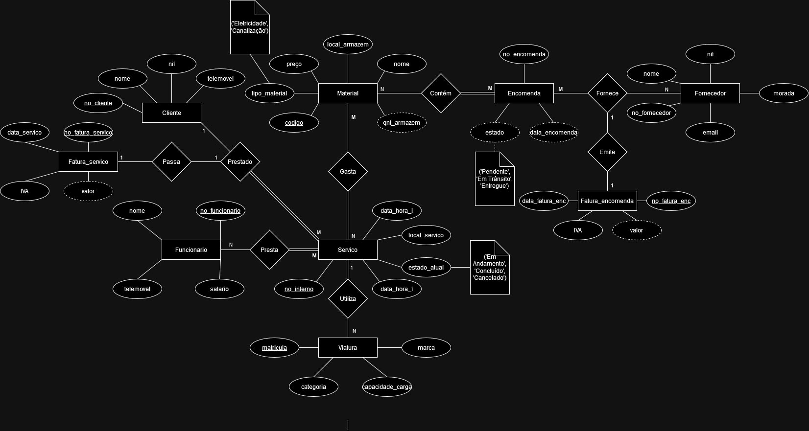
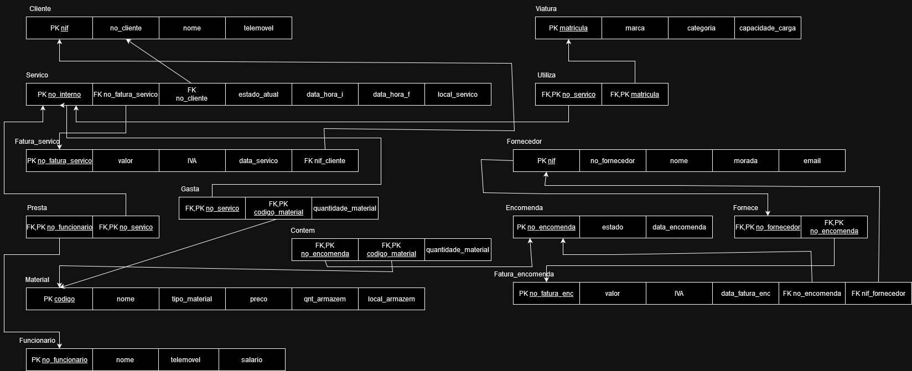

# BD: Trabalho Prático APF-T

**Grupo**: P7G7
- José Cerqueira, MEC: 76758
- Guilherme Almeida, MEC: 120069

## Introdução
 
O objetivo principal da unidade curricular Base de Dados é criar uma base de dados baseada e aplicável a uma situação do mundo real. E tendo em conta esta ideia principal criamos uma base de dados baseada numa empresa de canalização e eletricidade.

O seguinte relatório apresenta os principais componentes da base de dados assim como o código que leva à sua criação.

## ​Análise de Requisitos

Os seguintes pontos deveriam ser cumpridos:
- Criar serviços e atualizar o seu estado quando deixar de trabalhar nele. 
- Fazer a alocação de recursos entre serviços, tais como funcionários, viaturas e materiais.
- Ter capacidade de gerir a quantidade de stock disponível em armazém e saber quando necessita de mais.
- Fazer encomendas para reabastecer o armazém.
- Ver as faturas de serviços e encomendas, assim como criá-las automaticamente

## DER - Diagrama Entidade Relacionamento

### Versão final



## ER - Esquema Relacional

### Versão final



## APFE - Melhorias

Descreva sumariamente as melhorias sobre a primeira entrega.

## ​SQL DDL - Data Definition Language

[SQL DDL File](sql01_ddl.sql "SQLFileQuestion")

## SQL DML - Data Manipulation Language

[SQL Inserts File](sql02_inserts.sql "SQLFileQuestion")

Uma secção por formulário.

### Formulario exemplo/Example Form


```sql
-- Show data on the form
SELECT * FROM MY_TABLE ....;

-- Insert new element
INSERT INTO MY_TABLE ....;
```

...

## Normalização/Normalization

  Durante a criação da nossa base de dados tivemos o cuidado de criar as suas tabelas e atributos já na forma normalizada BCNF cumprindo todas as regras até este nível, logo não houve a necessidade de realizar alterações a tabelas ao longo do resto do trabalho com o intuito de normalizar a base de dados. Houve ocasiões em que foi necessário alterar tabelas por outras razões e nesses casos teve-se o cuidado para não quebar todas as regras de normalização até ao BCNF.

## Índices/Indexes

 Criou-se índices para as tabelas que eram utilizadas com mais frequência nos nossos triggers e stored procedures. Não se quiz criar muito índices devido aos pontos negativos que estes trazem quand inseridos em alta quantidade (Exemplo: Aumento do volume dos dados armazenados e do tempo de inserções)

```sql
CREATE INDEX idxMCod ON Material(Codigo);
CREATE INDEX idxSNo ON Servico(no_interno);
CREATE INDEX idxENo ON Encomenda(no_encomenda);
```

## SQL Programming: Stored Procedures, Triggers, UDF

[SQL SPs and Functions File](sql03_sp_functions.sql "SQLFileQuestion")

[SQL Triggers File](sql04_triggers.sql "SQLFileQuestion")


 